# Image Classification using AWS SageMaker

Use AWS Sagemaker to train a pretrained model that can perform image classification by using the Sagemaker profiling, debugger, hyperparameter tuning and other good ML engineering practices. This can be done on either the provided dog breed classication data set or one of your choice.

This project finetunes a pretrained CNN model Resnet18 via pytorch for categorisation of dog breeds into 133 different classifications using a provided Dog Breeds dataset.

## Project Set Up and Installation
Enter AWS through the gateway in the course and open SageMaker Studio. 
Download the starter files.
Download/Make the dataset available. Upload the data to an S3 bucket through the AWS Gateway so that SageMaker has access to the data. 

There are three files provided as the starter files, which is the
 - train_and_deploy.ipynb, the main notebook that we used for training.
 - train_model.py to be used for model profiling and debugging.
 - hpo.py are used for hyperparamter tuning.

We start by working through the train and deploy notebook.
Then we setup the hyperparameter tuning job.
Once the tuning is completed, we then choose the best trained model's hyperparamter.
create and finetune a new model, profiling and debugging with the above best hyperparameter
Examine the results of the above profiling and debugging.
Deploy the model to AWS as an endpoint
Test the endpoint with our own images.

## Hyperparameter Tuning
I went with a single layer Linear NN and the ResNet18 model. ResNet18 is a well-known pretrained CNN, and the results of a single layer NN were sufficient for good training outcomes. 
I choose to tune the following hyperparameters:
 - Learning rate 1e-4, 1e-1
 - Weight decay 1e-3, 1e-1
 - Batch size 31,64
 - epsilon value 1e-9, 1-e7

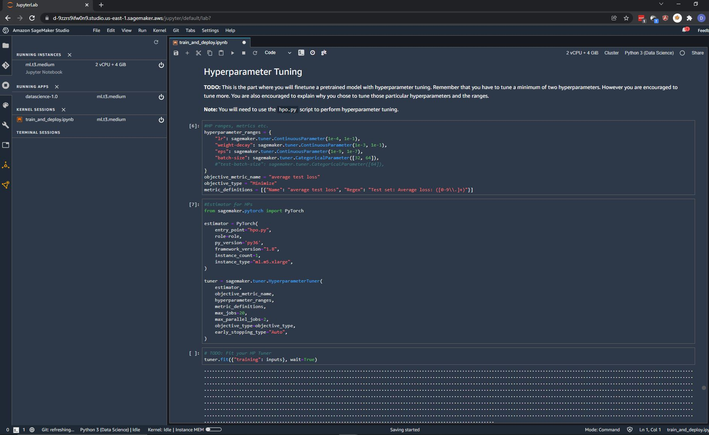
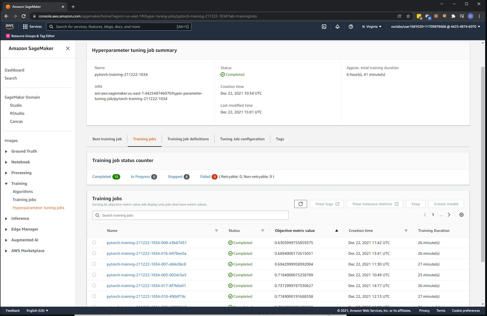
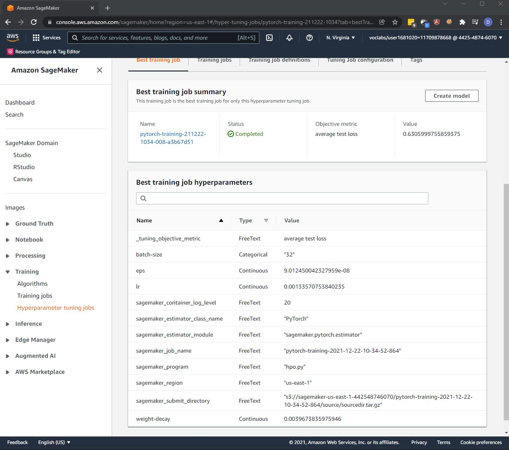
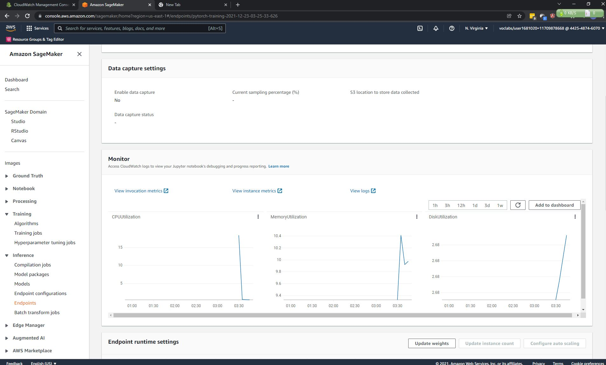
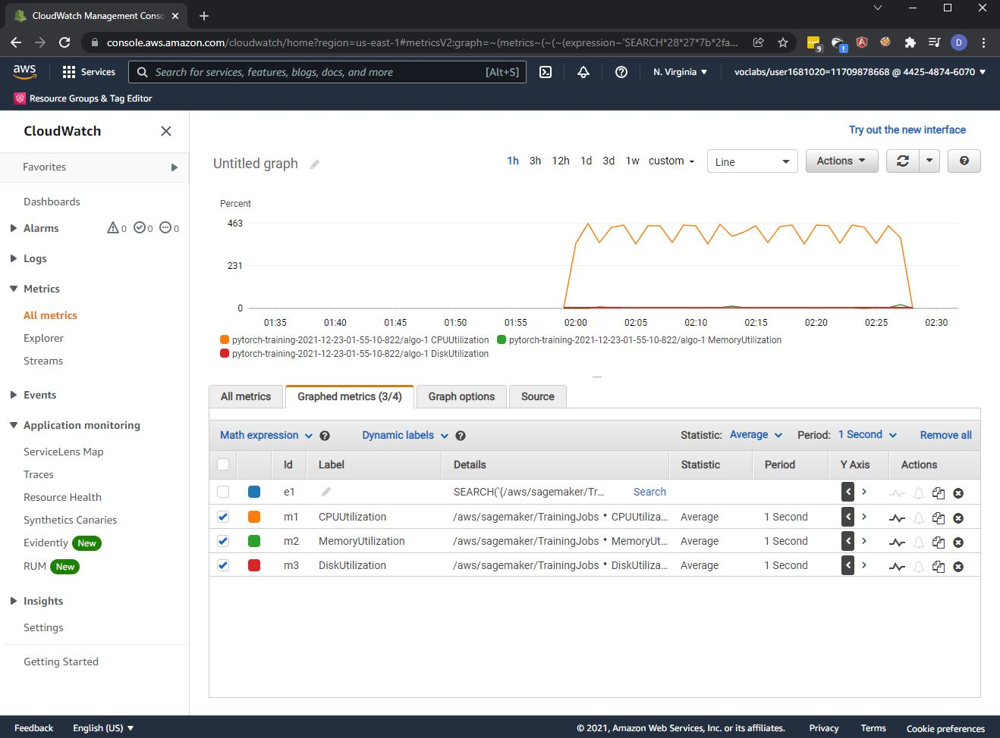

What kind of model did you choose for this experiment and why? Give an overview of the types of parameters and their ranges used for the hyperparameter search.
The best hyperparamter is obtained from the sagemaker tab best training job instead of via code here due to the sagemaker timing out when waiting for tuning job to finish (which take 6 hours to run)

## Debugging and Profiling
Debugging the model is really hard as it took a very long time to run and test a particular change. 
Due to the long time take to run the hyper parameter tuning, the best hyperparameter are hardcoded for model fitting.

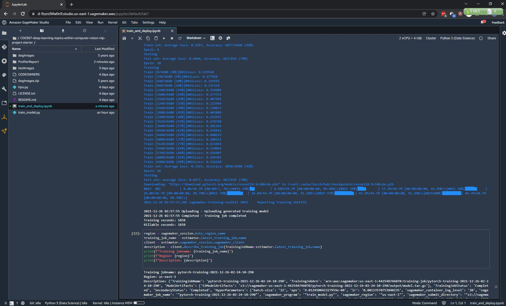

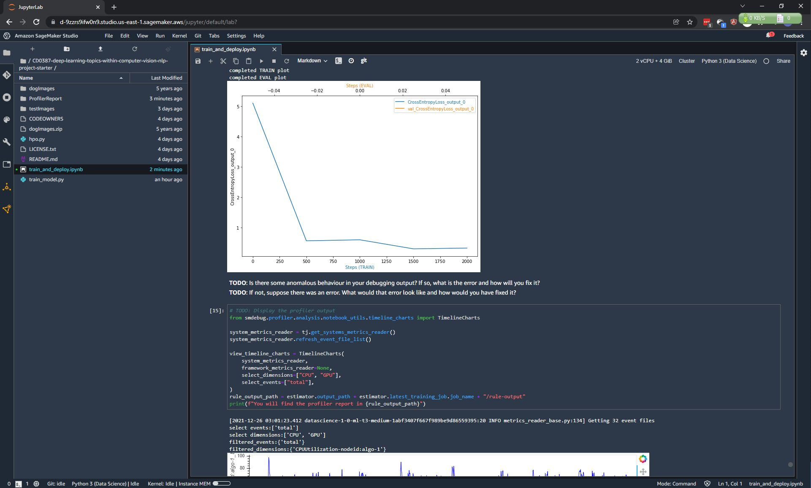

### Results

From the profiling generated, StepOutlier rule was the most frequenly triggered and it was triggered 15 times. 
we also found out that the only CPU resources is being utilized despite  . The profiller included suggestion to optimise the model
profiler html/pdf included in the project 

## Model Deployment
The deployed model run tuned Resnet18 and we can predict an endpoint by parsing in our own dog image and it will predict the category type of the dog.
Screen shot of the deployed endpoint

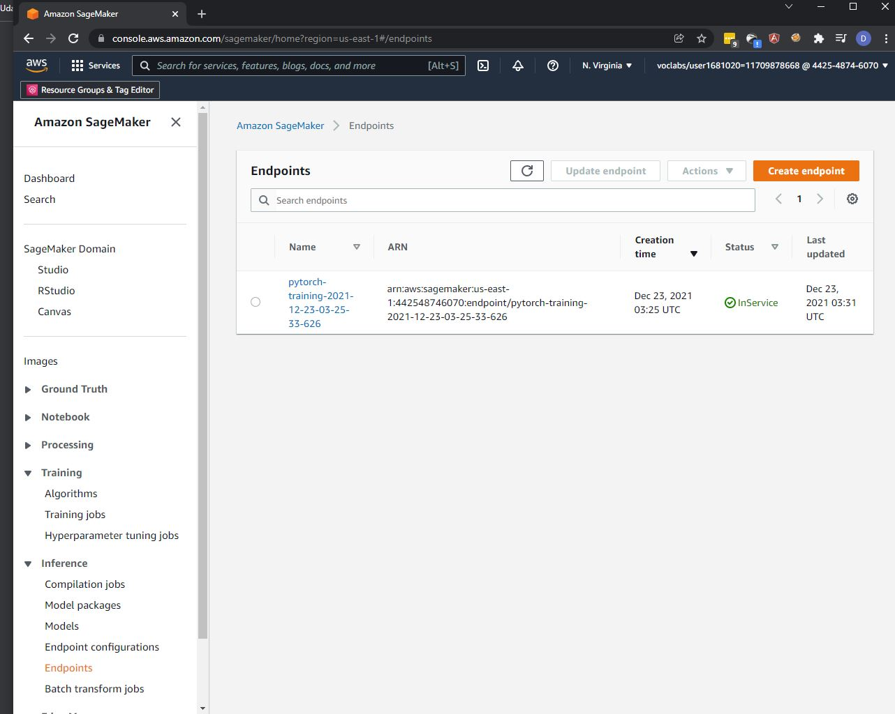

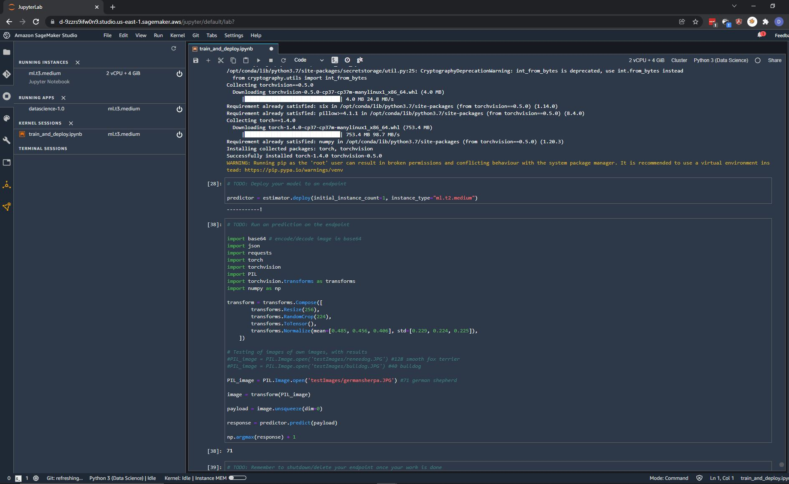

Tried The bullDog and successfully predict the correct category type 40.

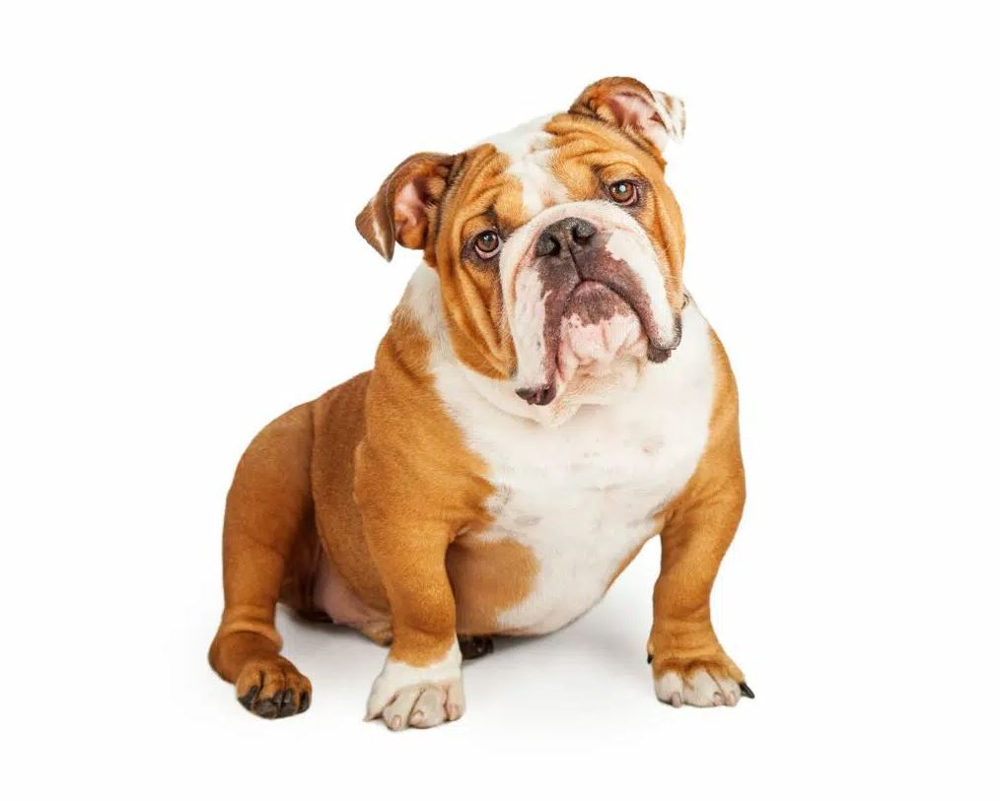

Has also tried The German Shepherd and successfully predict the correct category type 71.

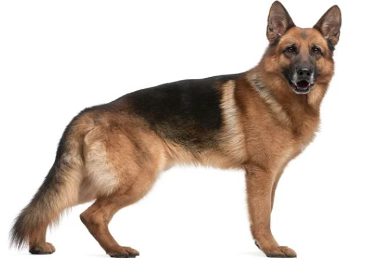

