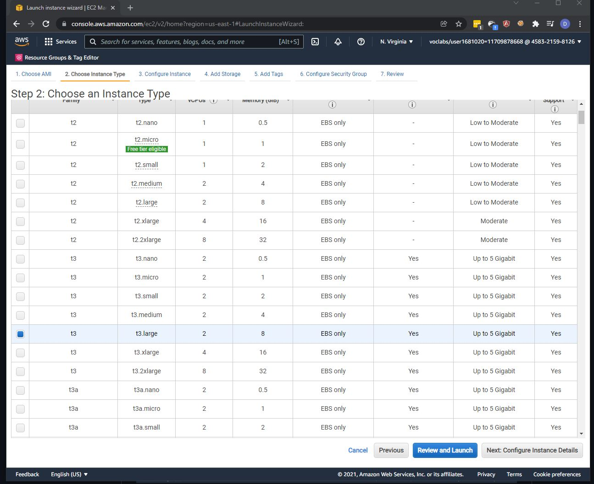

# Operationalizing Machine Learning on SageMaker

## Step 1 Training & Deployment
I chose the smallest SageMaker instance accessible for my notebook,'ml.t2.medium' , because I need to keep the notebook open through out the project and don't need a very powerful instance in terms of CPU or RAM.

I have then added the address of my S3 bucket `s3://c4-operational-ml-sagemaker-bucket` to all my relevant cell in the train_and_deploy-solution.ipynb notebook.

Additionally, I chose to use `ml.m5.2xlarge` for both tuning and training because it has greater processing power so that the tuning job and training jobs could be completed more quickly.

To speed up tuning and ensure that better hyperparameters were chosen, I increased `max_jobs` to 10 for tuning, `max_parallel_jobs` to 3, and early stopping type to "Auto."

The following is my trained endpoint as per the image below
* Single instance endpoint: `pytorch-inference-2021-12-31-02-52-43-385`
* Multi instance endpoint: `pytorch-inference-2021-12-31-03-25-17-395`

## Step 2 EC2 Training
Here I have used the image `Deep Learning AMI (Amazon Linux 2) Version 56.0` and the instance type 't3.xlarge'. This seemed to me to be a nice balance of performance and affordability. Because we are running a spot instance EC2 for training, it is logical to choose a more powerful instance type than is required so that we are able to quickly train our model, and the cost for spot instance are quite small. I have also limited the access to my EC2 instance to only my IP address for improved security. 

screenshot showing the result of model.pth

### Differences between ec2train1.py and hpo.py
When comparing the EC2 code to Step 1. The code that we worked in Step 1 was different as the code was written to work with SageMaker, and there are some differences in the code that we used in ectrain1.py, 
The argument parsing at the main are only done in Sage maker to print the argument out to notebook,  which we don't do when training in EC2.
The modules that we used are only can be used in SageMaker. such as Logger info that are used in SageMaker. 
Model debug hook for cloudwatch is another example as well that not in this example. I do also notice that the ec2 training using testdata.

## Step 3 Lambda functions
I have created the lambda function to the first endpoint I created to test the single instance trained endpoint. We are provided lamdafunction.py here and I have changed added the approriate single instance endpoint name here `endpoint_Name='pytorch-inference-2021-12-31-02-52-43-385'`
Since we are provided as a lamdafunction.py file, I have decided to just upload it as a zip. This lambda function essentially just invoke our SageMaker endpoint using the boto3 API from SageMaker. 
The response from the endpoint that was invoked, will then be read and be utf-8 decoded. The results are then converted to a JSON and return on the Body element.
I also noticed that the runtime here is also declared twice.
The lambda function take in the following Test Json as the input which is the url of an image of a dog.
`{ "url": "https://s3.amazonaws.com/cdn-origin-etr.akc.org/wp-content/uploads/2017/11/20113314/Carolina-Dog-standing-outdoors.jpg" }`

## Step 4 Security & Testing
In any Role-based access control, permission should always be given the least privilege, but in this example here, we have given the full access to the SageMaker. We could identify which service that the endpoint is using and we can just give that particular access. We could also introduce Session Authentication on the lambda function which only allow authenticated users to call the endpoints. We may also need to review the roles to make sure that all the roles that we are using are current and not inactive, to reduce the risk that it might belong to previous colleagues.
The root users that we used in this example also didn't utilize MFA as per the warning that we got on the IAM dashboard.

I got the following output before adding full access to SageMaker to the role running the lambda functions

I got the following output from a test after attaching full access role to SageMaker on the role running the lambda function:

## Step 5 Concurrency and auto-scaling
I chose reserved concurrency over shared concurrency because it is free and satisfies our current needs. Furthermore, we are unlikely to handle more than a few requests per endpoint instance at any given time, as this would indicate that the latter is overloaded, so having this value be a multiple of the number of endpoint instances makes sense, so I chose 100, allowing for 20 requests per endpoint instance.
I decided to let the endpoint scale out to between one and five instances. It should be enough for our use in this case for this project as ecause each prediction only take roughly 0.835 seconds to run.

