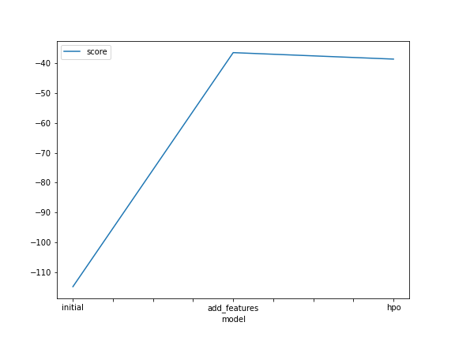
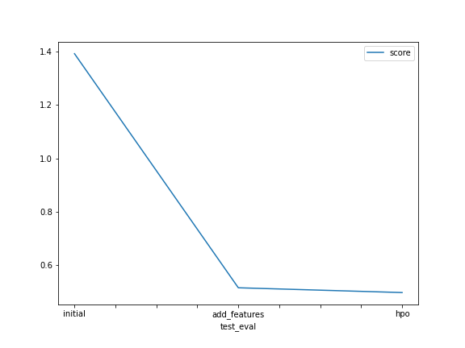

# Report: Predict Bike Sharing Demand with AutoGluon Solution
#### NAME HERE

## Initial Training
### What did you realize when you tried to submit your predictions? What changes were needed to the output of the predictor to submit your results?
There are 3 negative trip count. Kaggle will reject the submission if we have negative number. I have to set the negative values to 0.

### What was the top ranked model that performed?
`WeightedEnsemble_L3` was the top ranked model.

## Exploratory data analysis and feature creation
### What did the exploratory analysis find and how did you add additional features?
Through EDA Exploratory analysis, we have found that the `windspeed` and the `count` have an obvious right skew.
we have also determined that datetime is a poor feature as a string. We have created a new feature `hour` from the datetime string by converting it to a datetime object.

### How much better did your model preform after adding additional features and why do you think that is?
The model with an added additonal feature perform much better. The model score value increased from -114.786571 to -36.462086 by adding the one additional feature. This is also reflected on the kaggle score improved score.
The `hour` is also have a higher feature importance score. 

## Hyper parameter tuning
### How much better did your model preform after trying different hyper parameters?
The model score actually reduced slightly from -36.462086 to -38.628341 when running the autogluon locally, however the kaggle score improved slightly from 0.51492 to 0.49696. Trying different hyper parameters doesn't improve the performance score of the model as much as the improvement from the added features.
Hyper parameters can improve the efficiency of the model such as increasing the speed of the learning rate.

### If you were given more time with this dataset, where do you think you would spend more time?
If I were given more, I would spend more time on feature engineering task. We could create more feature such as `morning`, `afternoon` and `evening` from the `hour` to explore if rushhour period they would affect the score. We could also categorize `hot`,`cold`, or `mild temperature` from the `temp` feature.
We could also increase the training time for further improvement.

### Create a table with the models you ran, the hyperparameters modified, and the kaggle score.
|model|num_boost_round|learning_rate|num_trials|score|
|--|--|--|--|--|
|initial|100|0.1|1024|1.39256|
|add_features|100|0.1|1024|0.51492|
|hpo|200|0.2|500|0.49696|

### Create a line plot showing the top model score for the three (or more) training runs during the project.

### Create a line plot showing the top kaggle score for the three (or more) prediction submissions during the project.

## Summary
In this project, we have explored the AutoGluon which allow us to test multiple different ML model at once. We also have highlighted the importance of doing exploratory data analysis `EDA`, as it has shown that feature that have impacted the model performance. From the EDA, we found out that the datetime is an important feature when it is separated into 'hour' feature. There might be more improvement if we spend more time on creating new features. 

This shown that feature engineering important as it shown that it have a very big impact on the model performance, and the changing the hyperparameters doesn't have as much impact on the predictions score. 
In this project, I have choosen to tweak the `number_boost_round`, `learning_rate` and the `num_trials`, to try to improve the efficiency of the model. 
I have increased the number of tress to build by increasing the `number_boost_round`. 
The `learning_rate` is the shrinkage you do at every steps, I have double the default value to make it a bit more efficient.
I have also reduced the amount of times that the HPO trials should run by reducing the `num_trials`.
